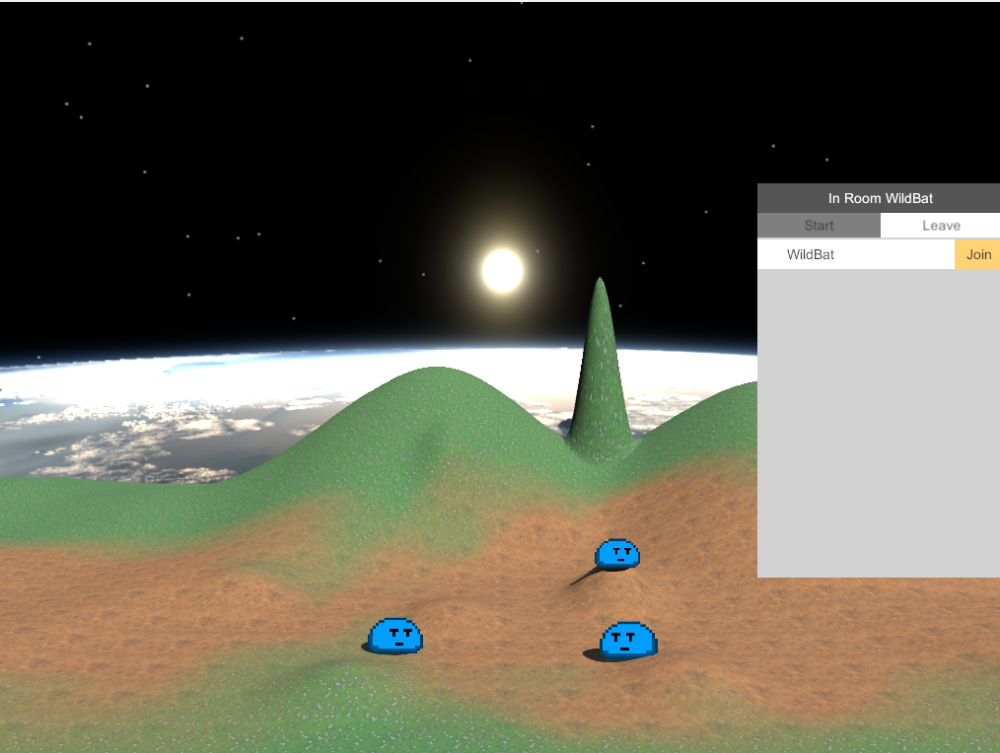

# Unity Multiplayer Slime Prototype

A lightweight multiplayer networking prototype built in Unity.  
This demo allows two players to host or join a session, move around a small 3D terrain, and see each other's 2D slime sprites collide and interact.

This project was created as a personal experiment to explore networking, physics syncing, and lightweight multiplayer architecture in Unity.

---

## Features

- **Peer-to-peer lobby system** (host or join a session)
- **Networked player movement**
- **Real-time position synchronization**
- **2D sprite characters in a 3D terrain**
- **Basic collision interactions between players**
- **Lightweight and dependency-free**

---

## Technologies

- **Unity Engine**
- **C#**
- **Unity Netcode for GameObjects (NGO)** or UNet/Photon (whichever you used — tell me and I'll update)
- Simple 3D terrain + 2D sprite rendering
- Basic rigidbody physics

---

## Screenshot

<p float="left">
  
</p>

---

## Project Structure

```
Unity-Multiplayer-Slime-Prototype/
│
├── Assets/
│   └── Scripts/          # Player movement, networking logic, sync transforms
│
├── Screenshots/          # Images used in this README
│
├── README.md
└── .gitignore            # Unity-optimized ignore file
```

---

## How It Works

1. **One player hosts a lobby**  
   - Creates a session  
   - Waits for incoming connections  

2. **Second player joins**  
   - Enters host IP / joins via Unity transport  
   - Spawns networked player prefab  

3. **Both players move around**  
   - Transform sync keeps positions updated  
   - Sprite animations mirror movement  

4. **Physics interactions**  
   - Rigidbody collisions handled locally  
   - State corrections synchronized  

---

## Scripts Included

- `PlayerMovement.cs`
- `NetworkManagerUI.cs`
- `PlayerCollisionHandler.cs`
- `SlimeAnimator.cs`
- `CameraFollow.cs`

(*Replace these with your actual filenames — or send them to me and I’ll auto-generate this section.*)

---

## Purpose

This prototype demonstrates:
- foundational networking knowledge  
- transform syncing  
- Unity scripting skills  
- multiplayer concepts  
- personal initiative and experimentation  

Great for showing employers hands-on gameplay engineering experience.

---
